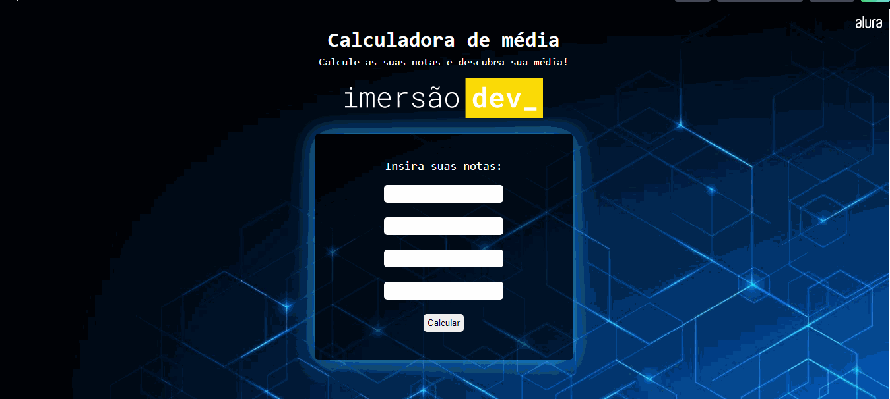

# calculadoraDeMedia
Projeto realizado na primeira aula da ImersãoDev.
##

Foi realizado um contador de média, usando JavaScript e CSS para a costumização.

##

  <a href="https://github.com/adriellemarques">
  

